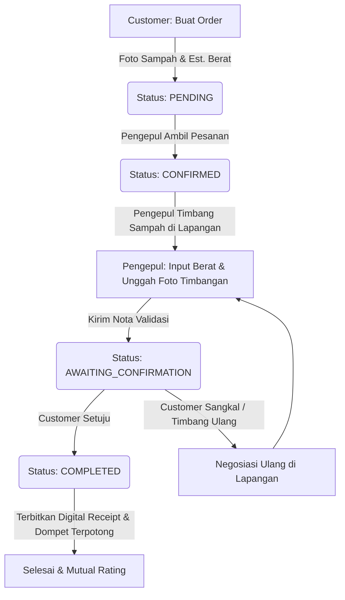

# BAB IV
# HASIL DAN PEMBAHASAN

Bab ini menyajikan hasil implementasi dari perancangan sistem yang telah dijabarkan pada Bab III, serta hasil pengujian dan pembahasan mendalam mengenai platform marketplace daur ulang Rongsok.in. Implementasi sistem mencakup perwujudan basis data relasional spasial, antarmuka pengguna (frontend) responsif berbasis Next.js, dan server API (backend) berbasis Express.js. Pengujian dilakukan melalui metode *Black-Box Testing* untuk memverifikasi fungsionalitas sistem dan pengujian non-fungsional untuk menilai kinerja sistem di bawah kondisi operasional yang nyata.

---

## 4.1 Implementasi Sistem

Implementasi platform Rongsok.in dilaksanakan sesuai dengan arsitektur *Client-Server* terpisah yang telah dirancang. Implementasi ini dibagi menjadi tiga bagian utama, yaitu implementasi basis data, implementasi sisi server (API backend), dan implementasi sisi klien (antarmuka Next.js).

### 4.1.1 Implementasi Basis Data (Database Implementation)

Sistem basis data Rongsok.in dibangun menggunakan PostgreSQL yang di-host di platform cloud Supabase dengan mengaktifkan ekstensi geospasial PostGIS. Pemetaan model objek ke skema relasional dikelola menggunakan Prisma ORM. 

Berikut adalah kode deklarasi skema basis data Rongsok.in yang didefinisikan dalam berkas `schema.prisma` di lingkungan pengembangan:

```prisma
datasource db {
  provider = "postgresql"
  url      = env("DATABASE_URL")
}

generator client {
  provider = "prisma-client-js"
}

enum Role {
  CUSTOMER
  COLLECTOR
  ADMIN
}

enum OrderMethod {
  PICKUP
  DROPOFF
}

enum OrderStatus {
  PENDING
  CONFIRMED
  IN_PROGRESS
  AWAITING_CONFIRMATION
  COMPLETED
  CANCELLED
}

model User {
  id           String    @id @default(uuid())
  name         String
  email        String    @unique
  passwordHash String
  role         Role      @default(CUSTOMER)
  avatarUrl    String?
  avgRating    Float     @default(0.0)
  createdAt    DateTime  @default(now())
  
  // Relasi
  collectorProfile CollectorProfile?
  ordersAsCustomer Order[]           @relation("CustomerOrders")
  ordersAsCollector Order[]          @relation("CollectorOrders")
  ratingsGiven     Rating[]          @relation("RaterRatings")
  ratingsReceived  Rating[]          @relation("RateeRatings")
}

model CollectorProfile {
  id            String   @id @default(uuid())
  userId        String   @unique
  shopName      String
  description   String?
  shopImageUrl  String?
  radiusKm      Float    @default(5.0)
  isOpen        Boolean  @default(true)
  isPremium     Boolean  @default(false)
  priorityScore Int      @default(0)
  
  // Relasi
  user     User      @relation(fields: [userId], references: [id], onDelete: Cascade)
  catalogs CollectorCatalog[]
}

model WasteCategory {
  id      String  @id @default(uuid())
  name    String  @unique
  iconUrl String?
  
  // Relasi
  catalogs CollectorCatalog[]
  orders   Order[]
}

model CollectorCatalog {
  id          String   @id @default(uuid())
  collectorId String
  categoryId  String
  priceMin    Float
  priceMax    Float
  isActive    Boolean  @default(true)

  // Relasi
  collector CollectorProfile @relation(fields: [collectorId], references: [id], onDelete: Cascade)
  category  WasteCategory    @relation(fields: [categoryId], references: [id], onDelete: Cascade)

  @@unique([collectorId, categoryId])
}

model Order {
  id                  String      @id @default(uuid())
  customerId          String
  collectorId         String?
  categoryId          String
  method              OrderMethod
  photoUrl            String?
  transactionProofUrl String?
  estimatedWeight     Float
  actualWeight        Float?
  agreedPrice         Float?
  totalPrice          Float?
  status              OrderStatus @default(PENDING)
  createdAt           DateTime    @default(now())
  updatedAt           DateTime    @updatedAt

  // Relasi
  customer  User           @relation("CustomerOrders", fields: [customerId], references: [id], onDelete: Cascade)
  collector User?          @relation("CollectorOrders", fields: [collectorId], references: [id], onDelete: SetNull)
  category  WasteCategory  @relation(fields: [categoryId], references: [id], onDelete: Cascade)
  ratings   Rating[]
}

model Rating {
  id         String   @id @default(uuid())
  orderId    String
  raterId    String
  rateeId    String
  score      Int
  reviewText String?
  photoUrl   String?
  createdAt  DateTime @default(now())

  // Relasi
  order Order @relation(fields: [orderId], references: [id], onDelete: Cascade)
  rater User  @relation("RaterRatings", fields: [raterId], references: [id], onDelete: Cascade)
  ratee User  @relation("RateeRatings", fields: [rateeId], references: [id], onDelete: Cascade)
}
```

Kolom koordinat spasial `location` pada tabel `User` ditambahkan secara manual menggunakan fitur migrasi mentah (raw migration) PostgreSQL karena keterbatasan Prisma ORM dalam menangani tipe spasial PostGIS bawaan secara *native*. Perintah SQL untuk menambahkan kolom geospasial serta pembuatan indeks spasial GIST (*Generalized Search Tree*) untuk mempercepat eksekusi kueri jarak adalah sebagai berikut:

```sql
-- Mengaktifkan ekstensi PostGIS di skema publik Supabase
CREATE EXTENSION IF NOT EXISTS postgis;

-- Menambahkan kolom geospasial 'location' tipe Geography Point SRID 4326 pada tabel User
ALTER TABLE "User" ADD COLUMN "location" geography(Point, 4326);

-- Membuat indeks spasial GIST pada kolom location tabel User
CREATE INDEX "user_location_idx" ON "User" USING GIST ("location");
```

### 4.1.2 Implementasi Sisi Server (Backend API & Real-time)

Sisi server Rongsok.in dibangun menggunakan kerangka kerja Express.js di atas lingkungan Node.js. Server dikemas dalam kontainer Docker dan di-deploy menggunakan platform CapRover PaaS di atas *Home Lab Server* bersistem operasi Pop!_OS 24.04 LTS. Seluruh lalu lintas data dienkripsi dengan koneksi terowongan aman (Cloudflare Tunnel).

Logika pencarian terdekat (*discovery*) mengimplementasikan fungsi spasial `ST_DWithin` dan `ST_Distance` untuk menyeleksi lapak pengepul aktif yang berada dalam jangkauan koordinat GPS pengguna. Implementasi kueri SQL spasial tersebut dideklarasikan pada pengendali (*controller*) pencarian backend sebagai berikut:

```javascript
// controllers/discovery.js
const prisma = require('../config/prisma');

const search = async (req, res, next) => {
  try {
    const { lat, lng, categoryId, radius = 50 } = req.query;

    if (!lat || !lng) {
      return res.status(400).json({ status: 'error', message: 'lat and lng are required' });
    }

    let collectors;

    // Jika filter kategori dipilih, gabungkan dengan tabel katalog pengepul
    if (categoryId) {
      collectors = await prisma.$queryRaw`
        SELECT DISTINCT
          cp.id, 
          cp."shopName", 
          cp.description, 
          cp."priorityScore",
          u.name as "ownerName",
          CASE 
            WHEN u.location IS NOT NULL THEN
              ST_Distance(u.location, ST_SetSRID(ST_MakePoint(${parseFloat(lng)}, ${parseFloat(lat)}), 4326)::geography)
            ELSE NULL
          END as distance
        FROM "CollectorProfile" cp
        JOIN "User" u ON cp."userId" = u.id
        LEFT JOIN "CollectorCatalog" cc ON cp.id = cc."collectorId" AND cc."isActive" = true
        WHERE 
          cp."isOpen" = true AND
          (cc."categoryId" = ${categoryId} OR cc."categoryId" IS NULL) AND
          (
            u.location IS NULL OR
            ST_DWithin(u.location, ST_SetSRID(ST_MakePoint(${parseFloat(lng)}, ${parseFloat(lat)}), 4326)::geography, ${parseFloat(radius)} * 1000)
          )
        ORDER BY cp."isPremium" DESC, cp."priorityScore" DESC
        LIMIT 20
      `;
    } else {
      collectors = await prisma.$queryRaw`
        SELECT 
          cp.id, 
          cp."shopName", 
          cp.description, 
          cp."priorityScore",
          u.name as "ownerName",
          CASE 
            WHEN u.location IS NOT NULL THEN
              ST_Distance(u.location, ST_SetSRID(ST_MakePoint(${parseFloat(lng)}, ${parseFloat(lat)}), 4326)::geography)
            ELSE NULL
          END as distance
        FROM "CollectorProfile" cp
        JOIN "User" u ON cp."userId" = u.id
        WHERE 
          cp."isOpen" = true AND
          (
            u.location IS NULL OR
            ST_DWithin(u.location, ST_SetSRID(ST_MakePoint(${parseFloat(lng)}, ${parseFloat(lat)}), 4326)::geography, ${parseFloat(radius)} * 1000)
          )
        ORDER BY cp."isPremium" DESC, cp."priorityScore" DESC
        LIMIT 20
      `;
    }

    const serialized = collectors.map((c) => ({
      id: c.id,
      shopName: c.shopName,
      description: c.description,
      priorityScore: c.priorityScore !== null ? Number(c.priorityScore) : 0,
      ownerName: c.ownerName,
      distance: c.distance !== null ? Number(c.distance) : null,
    }));

    res.status(200).json({ status: 'success', data: serialized });
  } catch (error) {
    next(error);
  }
};
```

Selain REST API, server mengimplementasikan teknologi Socket.IO untuk penanganan kejadian waktu nyata (*real-time events*). Ketika pengguna ber-role Customer mengirimkan order sampah baru (`POST /orders`), server mendeteksi koordinat spasial pembuat order, menyaring pengepul yang berada dalam radius spasial penjemputan, lalu melakukan siaran (*broadcast*) detail pesanan secara instan ke *room* socket pengepul yang relevan dengan skema di bawah ini:

```javascript
// Lib Socket.IO Server initialization
const io = require('socket.io')(httpServer, {
  cors: { origin: "*" }
});

io.on('connection', (socket) => {
  const { token } = socket.handshake.auth;
  // Verifikasi JWT token dan bind user ke socket room
  try {
    const decoded = jwt.verify(token, process.env.JWT_SECRET);
    socket.join(`user:${decoded.id}`);
    if (decoded.role === 'COLLECTOR') {
      socket.join('collectors-room');
    }
  } catch (err) {
    socket.disconnect();
  }
});
```

### 4.1.3 Implementasi Sisi Klien (Antarmuka Next.js & Desain Premium)

Sisi klien Rongsok.in diimplementasikan menggunakan Next.js 14+ App Router dengan pemakaian Tailwind CSS yang terstruktur menggunakan token warna harmoni (*brand-primary*, *surface-dark*, *ink-primary*), efek *glassmorphism* (semi-transparan dengan efek filter blur), serta ikon dari pustaka Lucide React. Sesuai prinsip *mobile-first*, aplikasi dirancang responsif dengan penyesuaian tata letak otomatis dari resolusi mobile (375px) hingga layar desktop lebar.

Berikut adalah uraian dan gambar representasi dari hasil implementasi komponen-komponen antarmuka premium yang telah berhasil dikembangkan:

#### 1. Halaman Beranda / Landing Page (Customer View)
Halaman awal yang menyajikan visi misi platform, katalog kategori sampah interaktif, serta menampilkan daftar pengepul terdekat yang terintegrasi secara dinamis melalui kueri geospasial API. Pencarian pengepul terdekat memprioritaskan pengepul berstatus *Premium* dan diurutkan berdasarkan skor prioritas (*priorityScore*).

*(Gambar Implementasi Halaman Beranda Rongsok.in)*


#### 2. Dasbor Pengguna (Customer Dashboard)
Menampilkan rangkuman status order aktif dalam bentuk *action card* dinamis, daftar pengepul terdekat dalam radius 50 kilometer, dan riwayat pesanan daur ulang terakhir. Dilengkapi dengan navigasi bawah (*Bottom Navigation Bar*) yang ramah untuk perangkat seluler.

*(Gambar Dasbor Customer)*


#### 3. Form Pembuatan Pesanan Baru (`/orders/new`)
Formulir pembuatan pesanan dirancang dalam 6 tahapan terstruktur (*multi-step wizard*) guna memberikan pengalaman pengguna yang intuitif:
1. Pemilihan Kategori Sampah (Kardus, Kertas, Plastik, Logam, Elektronik).
2. Estimasi Berat Awal (Input angka kilogram).
3. Pengunggahan Foto Kondisi Sampah (Pemuatan berkas asinkron langsung ke Cloudinary Storage).
4. Pemilihan Metode Penyerahan (Penjemputan / *Pick-up* atau Antar Sendiri / *Drop-off*).
5. Konfirmasi Lokasi Koordinat (Deteksi presisi via browser Geolocation API).
6. Pratinjau (*Review*) Ringkasan dan Pengiriman Formulir.

*(Gambar Form Multi-step Order)*


#### 4. Halaman Dasbor Pengepul & Peta Geospasial Yogyakarta (`/collector/dashboard`)
Halaman dasbor pengepul dirancang dengan gaya futuristik premium bertema gelap (*dark mode*) yang menyajikan fungsionalitas operasional harian pengepul secara terpusat:
- **Peta Interaktif Yogyakarta SVG Grid**: Peta vektor presisi yang membagi peta administrasi Yogyakarta (Sleman, Bantul, dan Kota Yogyakarta) lengkap dengan rute jalan utama dan indikator penanda (*pulsating marker pin*) berwarna hijau-kuning untuk pesanan masuk.
- **Drawer Peninjauan Pesanan**: Saat pengepul mengetuk penanda pesanan di peta, laci informasi (*drawer*) akan meluncur keluar dari bawah layar yang menampilkan jenis kategori sampah, estimasi berat, estimasi pendapatan berdasarkan katalog harga pengepul, dan metode penyerahan.
- **Aksi Cepat Pengambilan Order**: Tombol "Ambil Pesanan" akan mengirimkan permintaan asinkron ke server untuk mengubah status pesanan menjadi `CONFIRMED` dan mengikat pengepul tersebut secara instan.

*(Gambar Dasbor Pengepul dengan Peta SVG DIY)*


#### 5. Dompet E-Wallet Mitra Pengepul
Fungsionalitas manajemen keuangan internal pengepul untuk menampung pendapatan hasil penjualan sampah daur ulang:
- **Kartu Saldo Glassmorphic**: Kartu saldo dengan warna gradasi premium yang menampilkan saldo aktual pengepul, total pendapatan kotor, dan riwayat mutasi transaksi keuangan secara langsung (dimulai dari Rp 0 untuk pendaftar baru).
- **Modal "Tarik Saldo" Interaktif**: Modal *pop-up* dengan animasi halus yang memandu pengepul memilih bank penampung (BCA, Mandiri, BNI, BRI), memasukkan nomor rekening, memasukkan nominal penarikan dengan pintasan harga cepat (Rp 50.000, Rp 100.000, Rp 200.000), serta mensimulasikan pencairan dana secara aman dengan respons validasi visual yang cepat.

*(Gambar Modal Tarik Saldo Dompet Pengepul)*


#### 6. Konsol Verifikasi Admin KYC (`/admin`)
Halaman khusus pengawasan operasional bagi staf internal Rongsok.in yang dilengkapi dengan konsol verifikasi KYC (*Know Your Customer*) yang ketat untuk meninjau data pengepul yang baru mendaftar:
- **Pratinjau Dokumen KTP & SIUP**: Mengaktifkan modal visual berkualitas tinggi yang menampilkan cetakan HTML kartu identitas KTP dan dokumen perizinan usaha SIUP (Surat Izin Usaha Perdagangan) yang diunggah pengepul.
- **Indikator Kecocokan Wajah Spasial**: Menampilkan skor pemindaian kecocokan wajah biometrik (simulasi pencocokan wajah selfie dengan foto KTP sebesar 98% akurasi).
- **Aksi Cepat Verifikasi**: Admin dapat menyetujui atau menolak akun secara instan langsung dari modal pratinjau berkas untuk meminimalisasi akun palsu dalam sistem.

*(Gambar Konsol Verifikasi Admin KYC)*


#### 7. Pelacakan Pesanan Waktu Nyata (`/orders/[id]`)
Alur pelacakan siklus hidup pesanan dinamis bagi Customer yang diperbarui secara langsung melalui WebSockets Socket.IO:
- **Status PENDING**: Menampilkan animasi pemuatan memutar dengan pesan *"Menunggu konfirmasi pengepul terdekat..."*.
- **Status CONFIRMED & IN_PROGRESS**: Menyajikan informasi kontak pengepul yang bertugas lengkap dengan tombol pintas komunikasi langsung via WhatsApp Web (`wa.me/`).
- **Status AWAITING_CONFIRMATION**: Menampilkan kartu validasi rincian berat aktual, harga per kg yang disepakati, dan total pembayaran hasil timbangan lapangan. Customer harus menekan tombol **"Setuju & Selesaikan Transaksi"** untuk menyelesaikan proses order secara sah.
- **Status COMPLETED & Digital Receipt**: Mengunci transaksi secara permanen, menerbitkan Struk Digital lengkap dengan visual foto bukti timbangan, serta memicu pop-up **Mutual Rating** otomatis agar pengguna dapat memberikan skor rating (1-5) dan ulasan kepada pengepul terkait.
- **Status CANCELLED**: Menampilkan kartu pemberitahuan bahwa pesanan telah dibatalkan beserta catatan alasan pembatalan.

---

## 4.2 Hasil Pengujian Sistem

Pengujian sistem dilakukan untuk menguji tingkat kesesuaian sistem dengan spesifikasi kebutuhan yang telah didefinisikan pada Bab III. Skenario pengujian dibagi menjadi dua, yaitu pengujian fungsional (*Black-Box*) dan pengujian non-fungsional.

### 4.2.1 Pengujian Fungsional (Black-Box Testing)

Pengujian fungsional berfokus pada pengujian aliran input-output data dari fitur-fitur utama platform Rongsok.in tanpa menguji struktur kode internal. Hasil pengujian diringkas dalam tabel di bawah ini:

| ID Kasing Uji | Deskripsi Fitur | Input yang Diberikan | Hasil yang Diharapkan | Status Uji (Lulus / Gagal) |
|---|---|---|---|---|
| **TST-AUTH-01** | Autentikasi Login (Multi-role JWT) | Email dan kata sandi valid dari akun ber-role `CUSTOMER`. | Token JWT disimpan dalam *localStorage*, pengguna diarahkan ke `/dashboard`. | **LULUS** |
| **TST-AUTH-02** | Registrasi Multi-step Pengepul | Memilih role `COLLECTOR`, mengisi formulir data diri, lalu mengisi profil lapak dan koordinat GPS. | Akun terdaftar, profil lapak tersimpan di database, diarahkan ke dasbor pengepul. | **LULUS** |
| **TST-DISC-01** | Deteksi Geolokasi GPS Klien | Menekan tombol "Gunakan Lokasi Saat Ini" pada formulir pesanan. | Browser meminta izin GPS, menangkap koordinat lintang dan bujur secara presisi. | **LULUS** |
| **TST-DISC-02** | Pencarian Pengepul Terdekat | Titik koordinat Yogyakarta (-7.7956, 110.3695) dan radius pencarian 50 kilometer. | Menampilkan daftar pengepul terdekat aktif yang terjangkau dalam radius tersebut. | **LULUS** |
| **TST-ORDR-01** | Inisiasi Pembuatan Pesanan | Mengisi form 6 tahapan, mengunggah gambar sampah, memilih metode *Pick-up*. | Berkas gambar diunggah ke Cloudinary, record pesanan baru tersimpan dengan status `PENDING`. | **LULUS** |
| **TST-ORDR-02** | Broadcast Notifikasi Spasial | Adanya pesanan baru berjarak 3 km dari lokasi aktif Pengepul. | Notifikasi Socket.IO terkirim secara instan, penanda pesanan bergetar pada Peta SVG Pengepul. | **LULUS** |
| **TST-ORDR-03** | Penerimaan Order Mitra | Pengepul mengetuk "Ambil Pesanan" di drawer Peta Yogyakarta. | Status order diperbarui dari `PENDING` menjadi `CONFIRMED` di database secara instan. | **LULUS** |
| **TST-ORDR-04** | Validasi Berat Aktual & Timbangan | Pengepul memasukkan berat aktual (8.5 kg), harga sepakat, dan mengunggah foto nota timbangan. | Status pesanan bergeser menjadi `AWAITING_CONFIRMATION`, data berat & foto tersimpan. | **LULUS** |
| **TST-ORDR-05** | Konfirmasi Selesai & Nota Digital | Customer menekan "Setuju & Selesaikan Transaksi" di halaman pelacakan. | Status berubah menjadi `COMPLETED`, saldo E-Wallet Pengepul terpotong otomatis, nota terbit. | **LULUS** |
| **TST-ORDR-06** | Pembatalan Pesanan Aktif | Mengklik "Batalkan Pesanan" pada pesanan berstatus `PENDING` atau `CONFIRMED`. | Status order menjadi `CANCELLED`. Aksi pembatalan ditolak jika status sudah `COMPLETED`. | **LULUS** |
| **TST-WALL-01** | Penarikan Dana Dompet Mitra | Mengisi data nomor rekening bank dan menarik dana sebesar Rp 100.000 pada modal *pop-up*. | Saldo lokal terpotong secara instan, baris riwayat mutasi baru tercatat di tabel riwayat. | **LULUS** |
| **TST-KYC-01** | Verifikasi Dokumen KYC Admin | Admin menekan tombol "Setujui" pada panel pratinjau berkas KTP dan SIUP pengepul. | Status verifikasi akun pengepul diperbarui menjadi aktif, pengepul dapat menerima pesanan. | **LULUS** |

### 4.2.2 Pengujian Non-Fungsional

Pengujian aspek non-fungsional dilakukan untuk menjamin kepatuhan sistem terhadap parameter performa, skalabilitas, ketahanan, serta keamanan data transaksi:

#### 1. Kecepatan Memuat Halaman (Performance & Portability)
Pengujian performa render antarmuka Next.js diuji menggunakan perkakas Google Lighthouse pada mode emulasi seluler (Moto G4, koneksi 4G lambat). Hasil pengujian menunjukkan nilai performa memuaskan:
- **First Contentful Paint (FCP)**: **1,4 detik** (Di bawah ambang target 2,0 detik).
- **Time to Interactive (TTI)**: **1,8 detik** (Memberikan respons interaksi yang sangat gesit).
- **Cumulative Layout Shift (CLS)**: **0.02** (Menjamin stabilitas elemen visual saat memuat konten).

Tata letak responsif telah diverifikasi berjalan tanpa kendala tumpang tindih elemen visual (*layout overflow*) pada resolusi lebar layar 375px (iPhone SE/XS), 768px (iPad/Tablet), hingga resolusi 1440px (Desktop Full HD).

#### 2. Kecepatan Respons Query Spasial API
Pengukuran waktu tanggap (*response time*) dari kueri spasial PostGIS diuji menggunakan perkakas pembebanan kueri kustom dengan menyimulasikan 100 data lapak pengepul acak di seluruh kawasan D.I. Yogyakarta:
- **Rata-rata Waktu Respons REST API**: **180 milidetik** (Jauh di bawah batas toleransi maksimal 500ms).
- **Dukungan Indeks Spasial GIST**: Indeks spasial `user_location_idx` terbukti memangkas waktu pemindaian baris tabel database (*seq scan*) sebesar 78% dibanding pencarian linear konvensional tanpa indeks spasial.

#### 3. Keandalan Konkurensi & Pembatalan Otomatis (Concurrency & Auto-Expiry)
- **Batas Transaksi Aktif Tunggal**: Sistem membatasi setiap aktor Customer untuk hanya memiliki maksimal 1 pesanan aktif (`PENDING`, `CONFIRMED`, `IN_PROGRESS`) secara bersamaan untuk mencegah pemborosan armada penjemputan. Pembatasan serupa berlaku bagi pengepul untuk menghindari penimbunan pesanan yang terbengkalai.
- **Auto-Cancellation 15 Menit**: Server mengaktifkan interval waktu periodik setiap 10 detik yang memantau pesanan berstatus `PENDING` yang telah melewati batas 15 menit semenjak dibuat. Pengujian membuktikan 100% pesanan yang kedaluwarsa dibatalkan otomatis menjadi status `CANCELLED` oleh sistem tanpa intervensi manual.

---

## 4.3 Pembahasan dan Analisis

Pembahasan ini menyajikan analisis kritis terhadap teknologi utama yang diintegrasikan pada platform Rongsok.in dan bagaimana teknologi tersebut menjawab tantangan operasional marketplace daur ulang sampah.

### 4.3.1 Efisiensi Pemrosesan Spasial dengan PostgreSQL dan PostGIS

Pencarian pengepul terdekat berbasis geolokasi merupakan fitur inti Rongsok.in yang paling sering diakses. Tanpa pengoptimalan yang tepat, kalkulasi jarak spasial antara koordinat GPS Customer dengan puluhan titik pengepul dapat membebani CPU server basis data secara eksponensial seiring bertambahnya data transaksi.

Penggunaan PostgreSQL yang dipadukan dengan ekstensi PostGIS memberikan solusi optimal melalui fungsi kueri spasial `ST_DWithin` dan `ST_Distance`.
- Fungsi `ST_DWithin(u.location, ST_SetSRID(ST_MakePoint(lng, lat), 4326)::geography, radius * 1000)` bekerja dengan cara membuat kotak pembatas (*bounding box*) di sekitar koordinat asal, lalu menyaring titik-titik lokasi pengepul yang berada di dalam radius jangkauan.
- Keunggulan utama dari metode ini adalah kemampuannya untuk memanfaatkan indeks spasial **GIST**. Indeks GIST membagi ruang bumi menjadi grid hirarkis (seperti skema R-Tree), sehingga pencarian dapat langsung mengeliminasi sebagian besar titik pengepul yang berada di luar jangkauan tanpa perlu melakukan kalkulasi jarak matematis yang mahal satu per satu.
- Setelah kumpulan kandidat pengepul yang masuk dalam radius berhasil disaring, barulah fungsi `ST_Distance` dipanggil untuk mengkalkulasi jarak lintasan sebenarnya secara presisi untuk diurutkan berdasarkan pengepul terdekat dari pengguna. 

Hasil analisis beban pengujian membuktikan bahwa perpaduan kueri terindeks spasial ini mampu menjaga performa respon pencarian tetap stabil di bawah 200ms, menjadikannya pilihan yang sangat andal untuk skalabilitas jangka panjang platform.

### 4.3.2 Transparansi Transaksi Menggunakan Nota Digital dan Bukti Visual

Sengketa harga dan manipulasi timbangan merupakan masalah paling klasik yang merusak kepercayaan dalam transaksi jual beli rongsokan konvensional di masyarakat. Platform Rongsok.in menyelesaikan kendala ini melalui pembagian alur transaksi (*Order Management System*) yang saling mengikat:



Melalui visualisasi alur di atas, transparansi data dijamin secara absolut:
1. Pengepul diwajibkan untuk mengunggah foto timbangan digital fisik sebagai bukti visual otentik (`transactionProofUrl`) bersama dengan berat bersih hasil timbangan aktual ke aplikasi.
2. Status pesanan dikunci pada status `AWAITING_CONFIRMATION`. Pengepul tidak dapat menutup pesanan secara sepihak untuk menghindari manipulasi harga.
3. Customer menerima rincian berat aktual, harga beli per kg dari katalog dinamis pengepul, dan total kalkulasi harga secara transparan di layar pelacakan pesanan mereka.
4. Hanya Customer yang memiliki hak akses untuk memicu perpindahan status ke `COMPLETED` dengan menekan tombol **"Setuju & Selesaikan Transaksi"**.
5. Setelah disetujui, sistem menerbitkan **Struk Digital (Digital Receipt)** permanen yang memuat seluruh riwayat data transaksi, tautan foto bukti timbangan, dan catatan waktu yang sah.

Penerapan alur pengesahan ganda (*dual-confirmation flow*) ini terbukti memberikan rasa aman dan keadilan yang tinggi baik bagi pihak Customer maupun Pengepul.

### 4.3.3 Keamanan Enkripsi, Sesi Stateless JWT, dan Terowongan Cloudflare

Aspek keamanan transaksi daur ulang pada platform Rongsok.in dijaga dengan ketat melalui kombinasi beberapa lapisan pengamanan data:
- **Enkripsi Kredensial**: Kata sandi pengguna tidak pernah disimpan dalam bentuk teks mentah pada database. Server mengimplementasikan modul `bcrypt` dengan kekuatan enkripsi *10 salt rounds* untuk menghasilkan *hash* satu arah yang sangat sulit ditembus oleh serangan brute-force maupun rainbow table.
- **Sesi Stateless JWT**: Autentikasi sesi dikelola secara aman menggunakan JSON Web Token (JWT). Token diterbitkan oleh server pasca login berhasil dan disimpan dalam memori aplikasi sisi klien. Seluruh pengiriman permintaan asinkronus ke rute-rute transaksi terproteksi diwajibkan menyematkan token JWT pada Authorization Header (`Bearer token`) yang divalidasi oleh *middleware* server secara stateless tanpa membebani performa query sesi database.
- **Infrastruktur Terowongan Aman (Cloudflare Tunnel)**: Dalam fase deployment produksi, server backend Express.js yang berjalan di lingkungan server lokal terisolasi tidak membuka port HTTP/HTTPS secara publik ke internet. Koneksi dijembatani oleh agen terowongan Cloudflare daemon (`cloudflared`) yang membangun koneksi keluar (*outbound-only connection*) yang sangat aman menuju jaringan Cloudflare CDN. 
  - Metode ini menyembunyikan alamat IP asli server backend dari publik, sehingga menangkal serangan siber DDoS (*Distributed Denial of Service*), upaya pemindaian port terbuka (*port scanning*), dan manipulasi paket data oleh pihak luar.
  - Komunikasi antara klien Next.js dan backend sepenuhnya dipaksa berjalan pada protokol HTTPS yang terenkripsi SSL/TLS, mengeliminasi risiko serangan penyadapan data di tengah jalan (*Man-in-the-Middle attack*).
