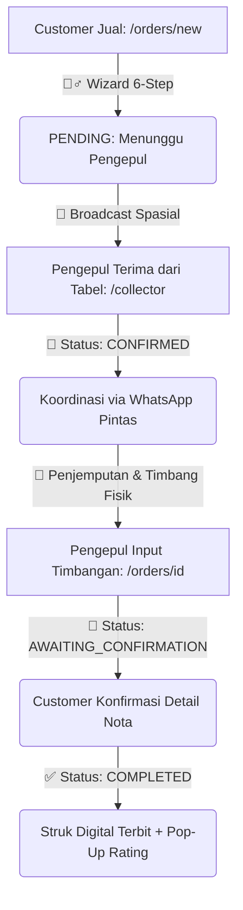

# 🎨 MASTER GUIDELINES: ALUR SISTEM & DIREKTIF REDESIGN PREMIUM RONGSOK.IN

Dokumen ini menjelaskan seluruh alur transaksi, arsitektur halaman, serta panduan estetika visual premium yang wajib diikuti untuk merombak ulang (*redesign*) UI/UX Rongsok.in. 

Tujuannya adalah mengubah tampilan yang terasa generik/biasa menjadi antarmuka kelas dunia (premium, modern, mobile-first, dan interaktif) demi memenangkan Lomba OLIVIA.

---

## 1. PETA JALUR & ARSITEKTUR HALAMAN (SITEMAP)

Aplikasi beroperasi secara mobile-first (base 375px) dengan navigasi bawah (BottomNav) dinamis sesuai peran pengguna (Role):

### A. Halaman Publik (Tanpa Login)
*   `GET /` (Landing Page): Informasi produk, daftar kategori sampah kering, ulasan testimoni, dan visualisasi interaktif.
*   `GET /login` & `/register`: Registrasi 3-tahap (Pilih Role -> Form Data -> Khusus Pengepul: Buat Profil Lapak).

### B. Dasbor Customer (Role: `CUSTOMER`)
*   `/dashboard`: Kartu ringkasan statistik (Total Sampah disetor & Pendapatan Tunai), daftar cepat per kategori sampah, daftar pengepul terdekat, dan riwayat setoran.
*   `/orders/new`: Alur wizard 6-tahap pembuatan order penjualan.
*   `/orders/[id]`: Halaman pelacakan status penjemputan, validasi timbangan, struk digital, dan ulasan rating.

### C. Dasbor Pengepul (Role: `COLLECTOR`)
*   `/collector`: Dasbor operasional gelap (Dark Mode) eksklusif. Menampilkan peta spasial pesanan masuk, tabel pesanan rebutan, statistik lapak harian (total transaksi, berat, pengeluaran), tombol buka/tutup lapak, dan Manajemen Katalog Harga.
*   `/orders/[id]`: Halaman pelacakan, koordinasi WhatsApp, **Form Input Timbangan Aktual & Harga Sepakat**, struk transaksi, dan mutual rating.

---

## 2. KRONOLOGI ALUR TRANSAKSI AKTIF (END-TO-END FLOW)

Berikut adalah alur perjalanan pengguna yang harus diakomodasi oleh desain UI/UX yang baru:

### Tahap 1: Customer Membuat Pesanan (`/orders/new`)
*   **Alur Pengalaman Pengguna**:
    1.  *Pilih Kategori*: Tombol grid kategori besar dengan ilustrasi modern.
    2.  *Estimasi Berat*: Penggeser (*slider*) interaktif atau input angka bergaya minimalis.
    3.  *Unggah Foto*: Penampung (*placeholder*) foto bergaya seret-dan-lepas (*drag-and-drop*) dengan pratinjau instan.
    4.  *Metode*: Pilihan besar berbentuk kartu antara **Jemput Kurir** (`PICKUP`) atau **Antar Sendiri** (`DROPOFF`).
    5.  *Peta Lokasi*: Penentuan koordinat GPS otomatis atau penyesuaian manual yang mulus.
    6.  *Review*: Ringkasan pesanan sebelum dikirim.

### Tahap 2: Rebutan Pesanan oleh Pengepul (`/collector`)
*   **Alur Pengalaman Pengguna**:
    *   Pengepul melihat daftar pesanan masuk dalam radius operasionalnya dalam bentuk **Tabel List** yang bersih di Dasbor Pengepul.
    *   Setiap baris menampilkan kategori rongsokan, estimasi berat, jarak dalam km, dan tombol aksi **"Terima Pesanan"**.
    *   Begitu pesanan diambil oleh satu pengepul, status berubah menjadi `CONFIRMED` dan otomatis hilang dari antrean pengepul lain (*Concurrency Guard*).

### Tahap 3: Koordinasi Penjemputan (`/orders/[id]` status `CONFIRMED`)
*   **Alur Pengalaman Pengguna**:
    *   Kedua belah pihak diarahkan ke halaman `/orders/[id]` masing-masing.
    *   Desain baru harus menonjolkan **Informasi Kontak Mitra** secara premium.
    *   Terdapat tombol pintas **"Hubungi via WhatsApp"** yang otomatis mengarah ke API WhatsApp eksternal dengan pesan teks *template* pembuka yang sopan.

### Tahap 4: Timbang & Validasi Lapangan (`/orders/[id]` status `AWAITING_CONFIRMATION`)
*   **Alur Pengalaman Pengguna**:
    *   Pengepul tiba di lokasi dan menimbang sampah fisik secara langsung bersama customer.
    *   Pengepul membuka detail pesanan di HP, lalu mengisi **"Form Timbangan Pengepul"** (Berat Aktual dalam kg dan Harga Satuan per kg yang disepakati).
    *   Data dikirim ke server backend (`PATCH /orders/:id/validate`), mengubah status transaksi menjadi `AWAITING_CONFIRMATION`.

### Tahap 5: Persetujuan Transaksi & Struk Digital (`/orders/[id]` status `COMPLETED`)
*   **Alur Pengalaman Pengguna**:
    *   Customer melihat rincian kalkulasi timbangan di layar HP-nya secara real-time.
    *   Customer mengeklik tombol **"Setuju & Selesaikan Transaksi"**.
    *   Pembayaran diselesaikan secara **Manual / COD** (Tunai atau Transfer langsung) di lapangan.
    *   Aplikasi langsung menerbitkan **Digital Receipt (Nota Digital Lunas)** bergaya struk kasir berombak yang sangat estetis, menampilkan detail berat, harga, total pengeluaran, dampak penyelamatan ekologis, dan memicu pop-up **Mutual Rating** (ulasan dua arah).

---

## 3. PANDUAN ESTETIKA REDESIGN PREMIUM (UI/UX DIRECTIVES)

Claude, saat merancang ulang halaman-halaman tersebut, pastikan Anda menerapkan standar visual kelas atas berikut ini:

1.  **Tipografi yang Kuat**:
    *   Gunakan font dekoratif berbobot tebal (*bold/extra-bold*) bergaya modern (seperti **Montserrat**, **Outfit**, atau **Inter**) untuk semua tajuk (*headings*).
    *   Gunakan font monospace yang rapi untuk semua data angka, berat (kg), ID pesanan, dan nominal harga (Rupiah) guna memberikan kesan presisi.
2.  **Harmoni Warna (Bebas dari Warna Primer Mentah)**:
    *   Hindari warna merah, hijau, atau biru murni bawaan browser.
    *   Gunakan skema warna kustom:
        *   `brand-500` (Emerald Green bernuansa premium untuk identitas daur ulang).
        *   `surface-raised` (Warna permukaan kartu yang sedikit menonjol dari latar belakang).
        *   `ink-muted` & `ink-faint` (Abu-abu curated untuk teks deskriptif dan garis tepi/border tipis).
3.  **Tampilan Dasbor Gelap (Dark Mode) untuk Pengepul**:
    *   Latar belakang dasbor pengepul wajib menggunakan warna gelap arang elegan (`slate-950`/`slate-900`), dipadukan dengan aksen tulisan hijau neon/emerald menyala untuk menonjolkan kesan profesionalitas operasional malam hari.
4.  **Glassmorphism & Border Lembut**:
    *   Gunakan kartu-kartu dengan efek semi-transparan, blur latar belakang (`backdrop-blur-sm`), lengkungan sudut besar (`rounded-2xl` atau `rounded-xl`), dan border tipis berwarna putih transparan atau abu-abu redup untuk menciptakan kedalaman visual (3D effect).
5.  **Elemen Struk Nota Digital Kasir**:
    *   Ubah tampilan Nota Digital di status `COMPLETED` menjadi replika nota belanja kasir fisik dengan aksen potongan bergelombang di bagian bawah kartu, menggunakan garis batas putus-putus (*dashed lines*), teks monospace, dan lencana cap `"LUNAS"` berwarna hijau stempel retro.
6.  **Desain Tombol dan Lencana (Badges)**:
    *   Gunakan lencana status transaksi yang sangat elegan dengan warna latar belakang yang diredam (*muted background*) dan warna teks yang kontras tajam (misal: kuning amber redup untuk status PENDING, emerald redup untuk COMPLETED).
